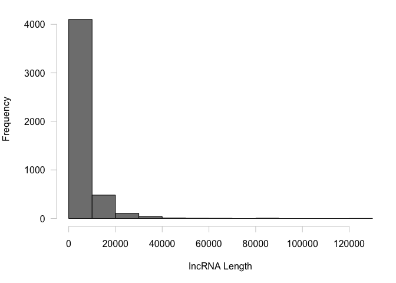
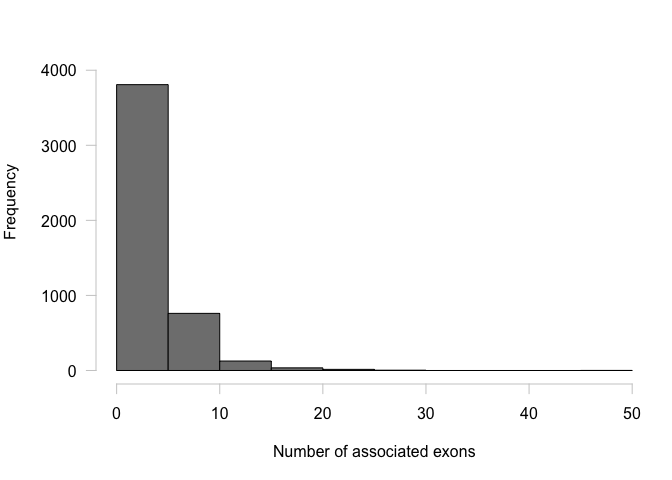

lncRNA Description
================
Yaamini Venkataraman
5/21/2019

``` r
sessionInfo()
```

    ## R version 3.5.3 (2019-03-11)
    ## Platform: x86_64-apple-darwin15.6.0 (64-bit)
    ## Running under: macOS Sierra 10.12.6
    ## 
    ## Matrix products: default
    ## BLAS: /Library/Frameworks/R.framework/Versions/3.5/Resources/lib/libRblas.0.dylib
    ## LAPACK: /Library/Frameworks/R.framework/Versions/3.5/Resources/lib/libRlapack.dylib
    ## 
    ## locale:
    ## [1] en_US.UTF-8/en_US.UTF-8/en_US.UTF-8/C/en_US.UTF-8/en_US.UTF-8
    ## 
    ## attached base packages:
    ## [1] stats     graphics  grDevices utils     datasets  methods   base     
    ## 
    ## loaded via a namespace (and not attached):
    ##  [1] compiler_3.5.3  magrittr_1.5    tools_3.5.3     htmltools_0.3.6
    ##  [5] yaml_2.2.0      Rcpp_1.0.1      stringi_1.4.3   rmarkdown_1.12 
    ##  [9] knitr_1.22      stringr_1.4.0   xfun_0.6        digest_0.6.18  
    ## [13] evaluate_0.13

Generate lncRNA track
=====================

``` bash
curl ftp://ftp.ncbi.nlm.nih.gov/genomes/Crassostrea_virginica/GFF/ref_C_virginica-3.0_top_level.gff3.gz > ref_C_virginica-3.0_top_level.gff3.gz #Download top-level file
gunzip ref_C_virginica-3.0_top_level.gff3.gz
head ref_C_virginica-3.0_top_level.gff3
```

    ##   % Total    % Received % Xferd  Average Speed   Time    Time     Time  Current
    ##                                  Dload  Upload   Total   Spent    Left  Speed
    ## 
      0     0    0     0    0     0      0      0 --:--:-- --:--:-- --:--:--     0
      0     0    0     0    0     0      0      0 --:--:-- --:--:-- --:--:--     0
      0 16.2M    0  106k    0     0  67873      0  0:04:10  0:00:01  0:04:09 67875
     51 16.2M   51 8541k    0     0  3314k      0  0:00:05  0:00:02  0:00:03 3314k
    100 16.2M  100 16.2M    0     0  5315k      0  0:00:03  0:00:03 --:--:-- 5316k
    ## gunzip: ref_C_virginica-3.0_top_level.gff3 already exists -- skipping
    ## ##gff-version 3
    ## #!gff-spec-version 1.21
    ## #!processor NCBI annotwriter
    ## #!genome-build C_virginica-3.0
    ## #!genome-build-accession NCBI_Assembly:GCF_002022765.2
    ## #!annotation-date 14 September 2017
    ## #!annotation-source NCBI Crassostrea virginica Annotation Release 100
    ## ##sequence-region NC_035780.1 1 65668440
    ## ##species https://www.ncbi.nlm.nih.gov/Taxonomy/Browser/wwwtax.cgi?id=6565
    ## NC_035780.1  RefSeq  region  1   65668440    .   +   .   ID=id0;Dbxref=taxon:6565;Name=1;chromosome=1;collection-date=22-Mar-2015;country=USA;gbkey=Src;genome=chromosome;isolate=RU13XGHG1-28;isolation-source=Rutgers Haskin Shellfish Research Laboratory inbred lines (NJ);mol_type=genomic DNA;tissue-type=whole sample

``` bash
grep "gbkey=ncRNA" ref_C_virginica-3.0_top_level.gff3 > C_virginica-3.0_Gnomon_lncRNA_yrv.gff3 #Parse out lncRNA and associated exons.
```

``` bash
head C_virginica-3.0_Gnomon_lncRNA_yrv.gff3
```

    ## NC_035780.1  Gnomon  lnc_RNA 13578   14594   .   +   .   ID=rna0;Parent=gene0;Dbxref=GeneID:111116054,Genbank:XR_002636969.1;Name=XR_002636969.1;gbkey=ncRNA;gene=LOC111116054;model_evidence=Supporting evidence includes similarity to: 100%25 coverage of the annotated genomic feature by RNAseq alignments%2C including 1 sample with support for all annotated introns;product=uncharacterized LOC111116054;transcript_id=XR_002636969.1
    ## NC_035780.1  Gnomon  exon    13578   13603   .   +   .   ID=id1;Parent=rna0;Dbxref=GeneID:111116054,Genbank:XR_002636969.1;gbkey=ncRNA;gene=LOC111116054;product=uncharacterized LOC111116054;transcript_id=XR_002636969.1
    ## NC_035780.1  Gnomon  exon    14237   14290   .   +   .   ID=id2;Parent=rna0;Dbxref=GeneID:111116054,Genbank:XR_002636969.1;gbkey=ncRNA;gene=LOC111116054;product=uncharacterized LOC111116054;transcript_id=XR_002636969.1
    ## NC_035780.1  Gnomon  exon    14557   14594   .   +   .   ID=id3;Parent=rna0;Dbxref=GeneID:111116054,Genbank:XR_002636969.1;gbkey=ncRNA;gene=LOC111116054;product=uncharacterized LOC111116054;transcript_id=XR_002636969.1
    ## NC_035780.1  Gnomon  lnc_RNA 169468  170178  .   -   .   ID=rna10;Parent=gene9;Dbxref=GeneID:111105702,Genbank:XR_002635081.1;Name=XR_002635081.1;gbkey=ncRNA;gene=LOC111105702;model_evidence=Supporting evidence includes similarity to: 100%25 coverage of the annotated genomic feature by RNAseq alignments%2C including 3 samples with support for all annotated introns;product=uncharacterized LOC111105702;transcript_id=XR_002635081.1
    ## NC_035780.1  Gnomon  exon    170129  170178  .   -   .   ID=id29;Parent=rna10;Dbxref=GeneID:111105702,Genbank:XR_002635081.1;gbkey=ncRNA;gene=LOC111105702;product=uncharacterized LOC111105702;transcript_id=XR_002635081.1
    ## NC_035780.1  Gnomon  exon    169907  169960  .   -   .   ID=id30;Parent=rna10;Dbxref=GeneID:111105702,Genbank:XR_002635081.1;gbkey=ncRNA;gene=LOC111105702;product=uncharacterized LOC111105702;transcript_id=XR_002635081.1
    ## NC_035780.1  Gnomon  exon    169622  169675  .   -   .   ID=id31;Parent=rna10;Dbxref=GeneID:111105702,Genbank:XR_002635081.1;gbkey=ncRNA;gene=LOC111105702;product=uncharacterized LOC111105702;transcript_id=XR_002635081.1
    ## NC_035780.1  Gnomon  exon    169468  169508  .   -   .   ID=id32;Parent=rna10;Dbxref=GeneID:111105702,Genbank:XR_002635081.1;gbkey=ncRNA;gene=LOC111105702;product=uncharacterized LOC111105702;transcript_id=XR_002635081.1
    ## NC_035780.1  Gnomon  lnc_RNA 900326  903430  .   +   .   ID=rna105;Parent=gene57;Dbxref=GeneID:111111519,Genbank:XR_002636046.1;Name=XR_002636046.1;gbkey=ncRNA;gene=LOC111111519;model_evidence=Supporting evidence includes similarity to: 100%25 coverage of the annotated genomic feature by RNAseq alignments%2C including 20 samples with support for all annotated introns;product=uncharacterized LOC111111519;transcript_id=XR_002636046.1

Subset lncRNA only (no associated exons)
----------------------------------------

``` bash
grep "lnc_RNA" C_virginica-3.0_Gnomon_lncRNA_yrv.gff3 > C_virginica-3.0_Gnomon_lncRNA_noexons_yrv.gff3
```

``` bash
head C_virginica-3.0_Gnomon_lncRNA_noexons_yrv.gff3
```

    ## NC_035780.1  Gnomon  lnc_RNA 13578   14594   .   +   .   ID=rna0;Parent=gene0;Dbxref=GeneID:111116054,Genbank:XR_002636969.1;Name=XR_002636969.1;gbkey=ncRNA;gene=LOC111116054;model_evidence=Supporting evidence includes similarity to: 100%25 coverage of the annotated genomic feature by RNAseq alignments%2C including 1 sample with support for all annotated introns;product=uncharacterized LOC111116054;transcript_id=XR_002636969.1
    ## NC_035780.1  Gnomon  lnc_RNA 169468  170178  .   -   .   ID=rna10;Parent=gene9;Dbxref=GeneID:111105702,Genbank:XR_002635081.1;Name=XR_002635081.1;gbkey=ncRNA;gene=LOC111105702;model_evidence=Supporting evidence includes similarity to: 100%25 coverage of the annotated genomic feature by RNAseq alignments%2C including 3 samples with support for all annotated introns;product=uncharacterized LOC111105702;transcript_id=XR_002635081.1
    ## NC_035780.1  Gnomon  lnc_RNA 900326  903430  .   +   .   ID=rna105;Parent=gene57;Dbxref=GeneID:111111519,Genbank:XR_002636046.1;Name=XR_002636046.1;gbkey=ncRNA;gene=LOC111111519;model_evidence=Supporting evidence includes similarity to: 100%25 coverage of the annotated genomic feature by RNAseq alignments%2C including 20 samples with support for all annotated introns;product=uncharacterized LOC111111519;transcript_id=XR_002636046.1
    ## NC_035780.1  Gnomon  lnc_RNA 1280831 1282416 .   -   .   ID=rna130;Parent=gene71;Dbxref=GeneID:111124195,Genbank:XR_002638148.1;Name=XR_002638148.1;gbkey=ncRNA;gene=LOC111124195;model_evidence=Supporting evidence includes similarity to: 100%25 coverage of the annotated genomic feature by RNAseq alignments%2C including 1 sample with support for all annotated introns;product=uncharacterized LOC111124195;transcript_id=XR_002638148.1
    ## NC_035780.1  Gnomon  lnc_RNA 1432944 1458091 .   +   .   ID=rna135;Parent=gene76;Dbxref=GeneID:111135942,Genbank:XR_002639675.1;Name=XR_002639675.1;gbkey=ncRNA;gene=LOC111135942;model_evidence=Supporting evidence includes similarity to: 100%25 coverage of the annotated genomic feature by RNAseq alignments%2C including 4 samples with support for all annotated introns;product=uncharacterized LOC111135942;transcript_id=XR_002639675.1
    ## NC_035780.1  Gnomon  lnc_RNA 1503802 1513830 .   -   .   ID=rna137;Parent=gene78;Dbxref=GeneID:111114441,Genbank:XR_002636574.1;Name=XR_002636574.1;gbkey=ncRNA;gene=LOC111114441;model_evidence=Supporting evidence includes similarity to: 100%25 coverage of the annotated genomic feature by RNAseq alignments%2C including 2 samples with support for all annotated introns;product=uncharacterized LOC111114441;transcript_id=XR_002636574.1
    ## NC_035780.1  Gnomon  lnc_RNA 1856841 1863697 .   -   .   ID=rna151;Parent=gene92;Dbxref=GeneID:111115591,Genbank:XR_002636863.1;Name=XR_002636863.1;gbkey=ncRNA;gene=LOC111115591;model_evidence=Supporting evidence includes similarity to: 100%25 coverage of the annotated genomic feature by RNAseq alignments%2C including 1 sample with support for all annotated introns;product=uncharacterized LOC111115591%2C transcript variant X1;transcript_id=XR_002636863.1
    ## NC_035780.1  Gnomon  lnc_RNA 1856841 1863683 .   -   .   ID=rna152;Parent=gene92;Dbxref=GeneID:111115591,Genbank:XR_002636864.1;Name=XR_002636864.1;gbkey=ncRNA;gene=LOC111115591;model_evidence=Supporting evidence includes similarity to: 100%25 coverage of the annotated genomic feature by RNAseq alignments;product=uncharacterized LOC111115591%2C transcript variant X2;transcript_id=XR_002636864.1
    ## NC_035780.1  Gnomon  lnc_RNA 2161223 2166803 .   +   .   ID=rna188;Parent=gene111;Dbxref=GeneID:111109763,Genbank:XR_002635698.1;Name=XR_002635698.1;gbkey=ncRNA;gene=LOC111109763;model_evidence=Supporting evidence includes similarity to: 100%25 coverage of the annotated genomic feature by RNAseq alignments%2C including 23 samples with support for all annotated introns;product=uncharacterized LOC111109763;transcript_id=XR_002635698.1
    ## NC_035780.1  Gnomon  lnc_RNA 2928484 2930094 .   -   .   ID=rna249;Parent=gene150;Dbxref=GeneID:111122009,Genbank:XR_002637875.1;Name=XR_002637875.1;gbkey=ncRNA;gene=LOC111122009;model_evidence=Supporting evidence includes similarity to: 100%25 coverage of the annotated genomic feature by RNAseq alignments%2C including 5 samples with support for all annotated introns;product=uncharacterized LOC111122009;transcript_id=XR_002637875.1

Create .csv file
----------------

``` bash
awk '{print $1","$3","$4","$5}' C_virginica-3.0_Gnomon_lncRNA_yrv.gff3 > C_virginica-3.0_Gnomon_lncRNA_yrv.csv #Generate a .csv file
```

``` bash
head C_virginica-3.0_Gnomon_lncRNA_yrv.csv #Confirm file creation
```

    ## NC_035780.1,lnc_RNA,13578,14594
    ## NC_035780.1,exon,13578,13603
    ## NC_035780.1,exon,14237,14290
    ## NC_035780.1,exon,14557,14594
    ## NC_035780.1,lnc_RNA,169468,170178
    ## NC_035780.1,exon,170129,170178
    ## NC_035780.1,exon,169907,169960
    ## NC_035780.1,exon,169622,169675
    ## NC_035780.1,exon,169468,169508
    ## NC_035780.1,lnc_RNA,900326,903430

``` r
lncRNAandExons <- read.csv("C_virginica-3.0_Gnomon_lncRNA_yrv.csv", header = FALSE) #Import lncRNA csv file
colnames(lncRNAandExons) <- c("chr", "region", "start", "stop") #Add column headers
head(lncRNAandExons) #Confirm changes
```

    ##           chr  region  start   stop
    ## 1 NC_035780.1 lnc_RNA  13578  14594
    ## 2 NC_035780.1    exon  13578  13603
    ## 3 NC_035780.1    exon  14237  14290
    ## 4 NC_035780.1    exon  14557  14594
    ## 5 NC_035780.1 lnc_RNA 169468 170178
    ## 6 NC_035780.1    exon 170129 170178

``` r
lncRNAOnly <- subset(lncRNAandExons, region == "lnc_RNA") #Subset out only lncRNA sections
head(lncRNAOnly) #Confirm subset
```

    ##            chr  region   start    stop
    ## 1  NC_035780.1 lnc_RNA   13578   14594
    ## 5  NC_035780.1 lnc_RNA  169468  170178
    ## 10 NC_035780.1 lnc_RNA  900326  903430
    ## 13 NC_035780.1 lnc_RNA 1280831 1282416
    ## 17 NC_035780.1 lnc_RNA 1432944 1458091
    ## 21 NC_035780.1 lnc_RNA 1503802 1513830

Number of lncRNA
----------------

``` r
length(lncRNAOnly$region) #Count number of lncRNA (line entries)
```

    ## [1] 4750

Overlaps between CG motifs
--------------------------

``` bash
curl http://eagle.fish.washington.edu/Cvirg_tracks/C_virginica-3.0_CG-motif.bed > C_virginica-3.0_CG-motif.bed #Download CG motif track
```

    ##   % Total    % Received % Xferd  Average Speed   Time    Time     Time  Current
    ##                                  Dload  Upload   Total   Spent    Left  Speed
    ## 
      0     0    0     0    0     0      0      0 --:--:-- --:--:-- --:--:--     0
      0  533M    0 4733k    0     0  45.7M      0  0:00:11 --:--:--  0:00:11 45.7M
     13  533M   13 73.5M    0     0  66.7M      0  0:00:07  0:00:01  0:00:06 66.7M
     24  533M   24  133M    0     0  63.3M      0  0:00:08  0:00:02  0:00:06 63.3M
     36  533M   36  192M    0     0  62.1M      0  0:00:08  0:00:03  0:00:05 62.1M
     46  533M   46  250M    0     0  60.0M      0  0:00:08  0:00:04  0:00:04 60.0M
     54  533M   54  291M    0     0  57.1M      0  0:00:09  0:00:05  0:00:04 57.3M
     65  533M   65  349M    0     0  57.1M      0  0:00:09  0:00:06  0:00:03 55.0M
     78  533M   78  419M    0     0  58.9M      0  0:00:09  0:00:07  0:00:02 57.1M
     89  533M   89  478M    0     0  58.9M      0  0:00:09  0:00:08  0:00:01 56.9M
    100  533M  100  533M    0     0  59.8M      0  0:00:08  0:00:08 --:--:-- 59.8M

``` bash
/Users/Shared/bioinformatics/bedtools2/bin/intersectBed -u -a C_virginica-3.0_CG-motif.bed -b C_virginica-3.0_Gnomon_lncRNA_noexons_yrv.gff3 | wc -l #CG motif overlaps with lncRNA (no associated exons)
```

    ##   281715

lncRNA lengths
--------------

``` r
lncRNAOnly$length <- lncRNAOnly$stop - lncRNAOnly$start #Obtain lncRNA length
head(lncRNAOnly)
```

    ##            chr  region   start    stop length
    ## 1  NC_035780.1 lnc_RNA   13578   14594   1016
    ## 5  NC_035780.1 lnc_RNA  169468  170178    710
    ## 10 NC_035780.1 lnc_RNA  900326  903430   3104
    ## 13 NC_035780.1 lnc_RNA 1280831 1282416   1585
    ## 17 NC_035780.1 lnc_RNA 1432944 1458091  25147
    ## 21 NC_035780.1 lnc_RNA 1503802 1513830  10028

``` r
par(mar = c(5, 5, 1, 1))
hist(lncRNAOnly$length,
     axes = FALSE,
     col = "grey50",
     xlab = "",
     ylab = "",
     main = "") #Rough histogram of lncRNA lengths
axis(side = 1, at = seq(0, 120000, by = 20000), col = "grey80") #Add x-axis
mtext(side = 1, "lncRNA Length", line = 3) #Add x-axis label
axis(side = 2, at = seq(0, 4000, by = 1000), las = 2, col = "grey80") #Add y-axis
mtext(side = 2, "Frequency", line = 4) #Add y-axis label
```



Number of exons associated with lncRNA
--------------------------------------

### Count number of associated exons

``` r
head(lncRNAOnly) #The "rownames" are essentially line numbers, where all line numbers aren't included were exon entries. To count the number of exons associated with each lncRNA, I can subtract the line numbers from eachother, then subtract 1. For example, there are 5-1-1 = 3 exons associated with the first lncRNA (lines 2, 3, 4), and 10-5-1 = 4 exons associated with the second lncRNA (lines 6, 7, 8, 9).
```

    ##            chr  region   start    stop length
    ## 1  NC_035780.1 lnc_RNA   13578   14594   1016
    ## 5  NC_035780.1 lnc_RNA  169468  170178    710
    ## 10 NC_035780.1 lnc_RNA  900326  903430   3104
    ## 13 NC_035780.1 lnc_RNA 1280831 1282416   1585
    ## 17 NC_035780.1 lnc_RNA 1432944 1458091  25147
    ## 21 NC_035780.1 lnc_RNA 1503802 1513830  10028

``` r
lncRNAOnly$rowNumbers <- as.numeric(rownames(lncRNAOnly)) #Save rownames in a new column
lncRNAOnly$numberExons <- rep(0, length(lncRNAOnly$chr)) #Create a new column to store number of associated exons
head(lncRNAOnly)
```

    ##            chr  region   start    stop length rowNumbers numberExons
    ## 1  NC_035780.1 lnc_RNA   13578   14594   1016          1           0
    ## 5  NC_035780.1 lnc_RNA  169468  170178    710          5           0
    ## 10 NC_035780.1 lnc_RNA  900326  903430   3104         10           0
    ## 13 NC_035780.1 lnc_RNA 1280831 1282416   1585         13           0
    ## 17 NC_035780.1 lnc_RNA 1432944 1458091  25147         17           0
    ## 21 NC_035780.1 lnc_RNA 1503802 1513830  10028         21           0

``` r
for (i in 2:length(lncRNAOnly$rowNumbers)) {
  lncRNAOnly$numberExons[i-1] <- lncRNAOnly$rowNumbers[i] - lncRNAOnly$rowNumbers[i-1] - 1
} #Count number of associated exons
lncRNAOnly$numberExons[length(lncRNAOnly$numberExons)] <- length(lncRNAandExons$chr) - lncRNAOnly$rowNumbers[length(lncRNAOnly$rowNumbers)] #Manually count exons associated with the last lncRNA
tail(lncRNAOnly) #Confirm counting worked.
```

    ##               chr  region    start     stop length rowNumbers numberExons
    ## 25842 NC_035789.1 lnc_RNA 32275438 32276585   1147      25842           4
    ## 25847 NC_035789.1 lnc_RNA 32276855 32278182   1327      25847           3
    ## 25851 NC_035789.1 lnc_RNA 32324528 32326683   2155      25851           4
    ## 25856 NC_035789.1 lnc_RNA 32419853 32422331   2478      25856           3
    ## 25860 NC_035789.1 lnc_RNA 32441009 32442289   1280      25860           3
    ## 25864 NC_035789.1 lnc_RNA 32631172 32632314   1142      25864           3

### Visualize data

``` r
par(mar = c(5, 5, 1, 1))
hist(lncRNAOnly$numberExons,
     axes = FALSE,
     col = "grey50",
     xlab = "",
     ylab = "",
     main = "",
     ylim = c(0, 4500)) #Rough histogram of lncRNA lengths
axis(side = 1, at = seq(0, 50, by = 10), col = "grey80") #Add x-axis
mtext(side = 1, "Number of associated exons", line = 3) #Add x-axis label
axis(side = 2, at = seq(0, 4000, by = 1000), las = 2, col = "grey80") #Add y-axis
mtext(side = 2, "Frequency", line = 4) #Add y-axis label
```


